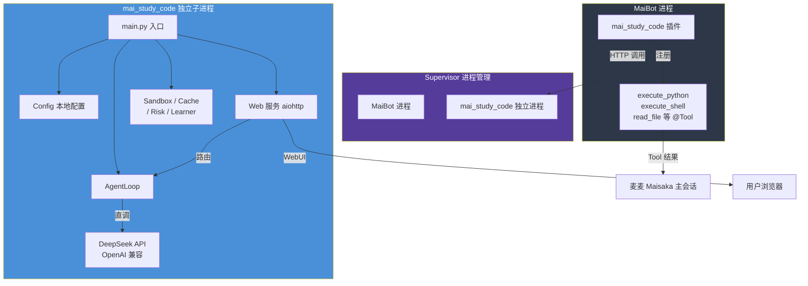
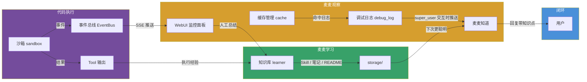

# 麦麦学代码 (Mai Study Code)

> 麦麦的代码学习伙伴，不是工具而是陪你一起成长的同路人。

---

## 最初构想

### 为什么做这个插件？

市面上已经有了 Claude Code、Kilo Code 这样强大的 AI 编程工具。它们起步就是顶级，能替代程序员完成复杂任务。但麦麦不一样——麦麦是一个有记忆、有感情、有人设的聊天机器人，她不适合做一个冷冰冰的代码工具。

**我想要的是一个能自进化的、一起学习的 code 伙伴，而不是又一个"帮我写代码"的工具。**

### 核心思考

1. **不是替代，是陪伴**：麦麦不应该替代你写代码，而是陪你一起学。她也会犯错，也会学习，也会成长。

2. **轻量优先**：Claude Code 和 Kilo Code 太重了。麦麦的 code 插件必须轻——不能无节制消耗 token，必须有缓存机制。麦麦应该自己想办法节省开支。

3. **麦麦要明白自己在做什么**：不是盲目执行命令。要自己写 README，自己写 Skill，对不清楚的地方要和用户讨论，不能自作主张。要能识别风险，知道什么操作危险。

4. **自进化**：每次解决问题的经验要沉淀下来，踩过的坑要记住。麦麦应该越用越聪明。

### 与 Claude Code / Kilo Code 的根本区别

| | Claude Code / Kilo Code | 麦麦学代码 |
|---|---|---|
| **定位** | 专业工具，替代程序员 | 学习伙伴，陪伴成长 |
| **能力起点** | 顶级，开箱即用 | 从零开始，逐步进化 |
| **交互模式** | 指令驱动 | 对话驱动 + 共同探索 |
| **知识管理** | 无持久记忆 | 本地知识库（Skill/README/笔记） |
| **风险态度** | 信任用户判断 | 主动识别风险，不确定时询问 |
| **Token 消耗** | 无节制 | 缓存优先，精打细算 |

---

## 架构设计

### 整体定位



### 双入口交互模式

```mermaid
flowchart LR
    subgraph Entry1["入口 1：日常对话（Maisaka）"]
        direction TB
        E1[用户发消息<br>"帮我算 1024*768"] --> E2{EventHandler<br>code_intent_detector}
        E2 -->|正则匹配到表达式| E3[沙箱直接执行]
        E2 -->|不匹配| E4[Maisaka Planner Loop]
        E4 -->|LLM 决定| E5[调用 Tool<br>execute_python / read_file 等]
        E3 --> E6[返回结果 · 麦麦回复]
        E5 --> E6
    end

    subgraph Entry2["入口 2：WebUI 代码面板"]
        direction TB
        F1[用户打开浏览器] --> F2[右侧聊天面板发消息]
        F2 --> F3[后端 _handle_chat]
        F3 --> F4[注入工作区上下文 + 人设风格]
        F4 --> F5[LLM 对话循环<br>最多 3 轮工具调用]
        F5 --> F6{有工具调用？}
        F6 -->|是| F7[执行 · 读文件 / 写文件 / 执行代码 / 切换目录]
        F7 --> F5
        F6 -->|否| F8[最终回复 · 保存到 data/chat/]
    end

    Entry1 -->|共享知识库| Knowledge
    Entry2 -->|共享知识库| Knowledge
```

### 数据流：麦麦是如何"观察-总结-学习"的



### 项目目录结构

```
plugins/mai_study_code/
├── _manifest.json          # 插件元数据 (Manifest v2)
├── plugin.py               # 插件入口（精简版：注册 Tool + EventHandler）
├── main.py                 # 独立进程入口（Supervisor 启动点）
├── agent_config.toml       # 独立进程配置文件
├── README.md               # 本文件
├── config.toml             # 插件配置（不纳入 git）
├── data/                   # 运行时数据（不纳入 git）
│   ├── workspaces.json     # 工作区配置
│   ├── stats.json          # 沙箱执行统计持久化
│   └── chat/               # Web 对话聊天记录归档
├── sandbox/                # 安全沙箱模块
│   ├── __init__.py
│   ├── limits.py           # 白名单/黑名单/资源限制配置
│   ├── ast_checker.py      # AST 静态安全检查器
│   └── executor.py         # 子进程隔离执行器
├── agent/                  # 代码智能体核心（独立子进程运行）
│   ├── __init__.py
│   ├── config.py           # 独立配置管理（替代 plugin.config）
│   ├── llm_client.py       # LLM API 直调（替代 plugin.ctx.llm）
│   ├── web_server.py       # 自持 aiohttp 服务（替代 PluginWebServer）
│   └── agent_loop.py       # LLM 对话循环 + 工具定义 + 工具执行
│   └── agent_loop.py       # LLM 对话循环 + 工具定义 + 工具执行
├── cache/                  # 缓存管理模块
│   ├── __init__.py
│   ├── semantic_cache.py   # 本地精确缓存 + 消息前缀规范
│   └── readme.md           # DeepSeek 缓存机制参考文档
├── risk/                   # 风险识别模块
│   ├── __init__.py
│   └── analyzer.py         # 四级风险评估 + 用户请求 & 代码双重分析
├── learner/                # 学习模块
│   ├── __init__.py
│   └── knowledge.py        # 本地知识库管理（skill/readme/note）
├── web/                    # Web 服务模块
│   ├── __init__.py
│   ├── event_bus.py        # 事件总线（SSE 推送）
│   ├── server.py           # HTTP 服务器（aiohttp）+ 僵尸进程清理
│   ├── routes.py           # 路由 + SSE + REST API
│   ├── page_builder.py     # Bot 页面管理器
│   ├── monitor.html        # 监控面板入口
│   ├── static/             # 前端静态文件
│   │   ├── css/
│   │   │   └── monitor.css # Frosted Glass 风格样式（CSS 变量体系）
│   │   ├── js/             # 9 个前端模块
│   │   │   ├── app.js      # 入口：window 绑定 + 模块初始化
│   │   │   ├── editor.js   # CodeMirror 6 编辑器
│   │   │   ├── editor-bootstrap.js # 编辑器引导与 Monaco 适配
│   │   │   ├── sidebar.js  # 文件树、侧边栏
│   │   │   ├── chat.js     # 对话面板 + SSE 流式
│   │   │   ├── workspace.js# 工作区标签 + 管理
│   │   │   ├── config.js   # 配置可视化编辑
│   │   │   ├── ui.js       # 通用 UI 组件
│   │   │   └── icons.js    # SF Symbols SVG 图标
│   │   └── monaco-editor/  # Monaco Editor 本地副本
│   ├── lib/                # 前端库
│   └── .npm_cache/         # CDN 文件缓存（自动生成）
├── tools/                  # 工具模块
│   ├── __init__.py
│   ├── file_ops.py         # 文件操作器（含 diff 修改 + 备份回滚）
│   ├── shell_executor.py   # Shell 执行器（含危险命令拦截）
│   └── workspace_manager.py# 多工作区管理器（local/root/ssh 三种类型）
├── debug_log/              # 调试日志模块
│   ├── __init__.py
│   └── logger.py           # 调试日志记录器（文件 + 交互推送）
└── workspace/              # 工作区（不纳入 git）
    └── web/                # Bot 的 Web 空间
        ├── theme.css       # 主题皮肤（Bot 可修改）
        └── pages/          # Bot 自写页面目录
```

### 与 Claude Code / Kilo Code 的根本区别

| | Claude Code / Kilo Code | 麦麦学代码 |
|---|---|---|
| **定位** | 专业工具，替代程序员 | 学习伙伴，陪伴成长 |
| **能力起点** | 顶级，开箱即用 | 从零开始，逐步进化 |
| **交互模式** | 指令驱动 | 对话驱动 + 共同探索 |
| **知识管理** | 无持久记忆 | 本地知识库（Skill/README/笔记） |
| **风险态度** | 信任用户判断 | 主动识别风险，不确定时询问 |
| **Token 消耗** | 无节制 | 缓存优先，精打细算 |
| **人设** | 无（工具人格） | 附身麦麦（Arch Linux 守护精灵） |
| **"观察"能力** | 无 | 通过事件总线 + 调试日志 + 知识库 |
| **"学习"闭环** | 无 | 执行经验 → 知识库 → 下次更聪明 |
| **归属** | 独立应用 | 麦麦插件，**是麦麦的一部分** |

### 核心模块

#### 1. 安全沙箱 (sandbox/)

四层纵深防御：

```
第1层: AST 静态扫描 → 禁止危险 import/函数调用（白名单模块 + 禁止 builtins）
第2层: Python 级限制 → 白名单 builtins + 安全模块白名单
第3层: OS 级限制   → ulimit + 独立工作目录 /tmp/mai_code_sandbox
第4层: 运行时监控   → 超时/内存/输出截断
```

- 内存限制：128MB
- CPU 时间：10s
- 墙上时间：15s
- 网络：完全禁止（禁止 socket/requests/urllib 等网络模块）
- 文件系统：独立临时目录 `/tmp/mai_code_sandbox`，仅允许只读 open
- 禁止相对导入、禁止写入模式 open、禁止子进程创建

#### 2. 缓存管理 (cache/)

对齐 DeepSeek API 硬盘缓存机制，两层设计：

| 层 | 机制 | 效果 |
|----|------|------|
| 本地精确缓存 | `(code, question)` → SHA256 → 直接返回 | 相同请求 0 token |
| 消息前缀规范 | `build_messages()` 保持 system+代码在前 | API 端自动前缀命中 |

清理策略：
- TTL 过期自动淘汰（默认 30 分钟）
- LRU 容量淘汰
- 话题切换感知清理（关键词重叠度 < 30%）
- 上下文窗口超出时丢弃最旧轮次（不调 LLM 压缩）
- 手动清理：`/code cache clear`

#### 3. 风险识别 (risk/)

四级风险评估，支持用户请求和代码内容双重分析：

| 等级 | 示例 | 处理 |
|------|------|------|
| CRITICAL | `rm -rf /`、`mkfs`、fork 炸弹、写系统配置 | 自动阻止 |
| HIGH | 删除数据库、`kill -9`、修改防火墙、网络操作 | 需用户确认 |
| MEDIUM | `pip install`、`git push --force`、文件写入、遍历文件系统 | 提示风险 |
| LOW | 普通计算、打印 | 直接执行 |

#### 4. 学习模块 (learner/)

本地知识库，JSON 文件持久化到 `knowledge/` 目录：
- **Skill**：学到的技能和经验
- **README**：项目理解
- **笔记**：踩坑记录和心得

#### 5. Web 服务 (web/)

插件内嵌 aiohttp HTTP 服务器，提供完整的 IDE 风格监控面板：

- **监控面板**：`/` — 文件树 + 编辑器 + 对话面板 + 配置管理一体化
- **SSE 实时推送**：`/api/stream` — 操作日志即时推送至对话面板
- **编辑器**：同时支持 CodeMirror 6 和 Monaco Editor
- **Bot 自写页面**：`/pages/<name>` — Bot 可以自己写 HTML 页面（theme.css 换肤）
- **文件管理**：CRUD（创建/读取/写入/删除/重命名）+ 文件树
- **工作区管理**：顶部栏齿轮 → 添加/切换/管理三类工作区（local / root / SSH）
- **LLM 对话**：右侧对话面板直接与 LLM 对话（带工具调用的 Claude Code 风格），支持流式 SSE
- **插件配置**：可视化编辑 + 文本编辑，保存后自动热重载
- **聊天记录**：每个工作区的对话自动持久化到 `data/chat/{workspace}.json`
- **端口清理**：启动时自动检测并清理占用端口的僵尸进程（SIGTERM → SIGKILL）
- **CDN 代理**：`/npm/` 路径自动代理 jsDelivr + 本地缓存
- **权限等级**：`/api/level` 展示当前等级名称

前端架构（9 个 ES module）：

```
monitor.html → static/js/app.js（window 绑定中心）
                  ├── editor.js          CodeMirror 6 编辑器
                  ├── editor-bootstrap.js Editor 引导 + Monaco 适配
                  ├── sidebar.js         文件树 + 已打开/最近打开
                  ├── chat.js            对话 + SSE 流式
                  ├── workspace.js       工作区标签 + CRUD
                  ├── config.js          可视化配置编辑
                  ├── ui.js              通用 UI 组件
                  └── icons.js           SF Symbols 图标库
```

所有 onclick 函数在 `app.js` 中统一绑定到 `window`，消除模块作用域与 HTML onclick 的矛盾。
新增功能只需三步：创建模块 → 在 app.js 中 import → 挂函数名到 window。

#### 6. 调试日志 (debug_log/)

将关键日志写入文件持久化，并在 super_user 交互时推送摘要：

- **日志文件**：写入 `workspace/debug.log`，自动轮转（最大 5MB，保留 2 份）
- **交互推送**：当 super_user 与 Bot 交互时，自动附带最近的调试日志摘要
- **Web 查看**：`/api/debug_log?count=50` 查看最近日志
- **日志类别**：startup（启动）、operation（操作）、cache（缓存状态）、error（错误）、emergency（紧急停止）、permission（权限）

#### 7. 多工作区管理器 (tools/workspace_manager.py)

支持三种工作区类型，通过 `data/workspaces.json` 持久化配置：

| 类型 | 说明 | 权限 |
|------|------|------|
| `local-sandbox` | 本地 a1 用户沙箱 | 限制在配置的根目录内，路径逃逸检测 |
| `local-root` | 本地 root（通过 su） | 全系统访问，需密码 |
| `ssh` | 远程 SSH（通过 asyncssh） | 支持密码和密钥认证，base64 传输文件 |

每种工作区都提供统一的 `list_files` / `read_file` / `write_file` / `execute` 接口。

---

## 命令列表

| 命令 | 说明 |
|------|------|
| `/code` | 显示帮助信息 |
| `/code run <代码>` | 在安全沙箱中执行 Python 代码 |
| `/code learn <标题> \| <内容>` | 记录学习笔记 |
| `/code search <关键词>` | 搜索知识库 |
| `/code stats` | 查看缓存和知识库统计 |
| `/code cache clear` | 清空所有缓存和上下文 |

---

## Tool 组件（LLM 可调用）

所有 Tool 通过 `visibility="visible"` 声明，LLM 在 MaiSaka 对话流中可直接触发 Function Call。

| Tool | 说明 | 权限要求 |
|------|------|----------|
| `execute_python` | 安全沙箱执行 Python 代码（计算/验证/调试） | Level 0 |
| `execute_shell` | Shell 命令执行（系统管理/文件操作/状态查看） | **root** |
| `read_file` | 读取工作区或白名单文件 | Level 1 |
| `write_file` | 写入/创建工作区文件 | Level 1 |
| `list_files` | 列出工作区目录内容 | Level 1 |
| `search_in_file` | 文件内容搜索（grep，正则支持） | Level 1 |
| `read_file_lines` | 文件指定行范围读取 | Level 1 |
| `apply_diff` | 精确替换文件内容（自动备份） | Level 1 |
| `rollback_file` | 回滚文件到历史备份 | Level 1 |

### Tool 调用链路

```
用户消息 → EventHandler(code_intent_detector)
              ├─ 正则匹配代码块/计算 → 直接沙箱执行（不走 LLM）
              └─ 不匹配 → 交由 MaiSaka Action Loop
                              └─ PluginToolProvider → 查询 9 个 @Tool 组件
                                                      └─ visibility=visible → LLM 直接触发 Function Call
```

### 重要：visibility="visible" 的必要性

MaiBot 的 `PluginToolProvider` 通过 `component_query.py` 中的 `_get_tool_visibility()` 判断工具可见性，插件 `@Tool` 默认 visibility 为 `"deferred"`，导致 MaiSaka 的 Action Loop 不会将工具定义传给 LLM API。LLM 只能通过 system prompt 的文字"知道"工具有哪些，但无法真正发起 Function Call。**所有插件 @Tool 必须显式设置 `visibility="visible"`**。

---

## 权限系统

| 等级 | 名称 | 能力 |
|------|------|------|
| 0 | 沙箱模式 | 纯计算（execute_python） |
| 1 | 工作区读写 | 文件操作（read/write/list/search/diff/rollback） |
| 2 | 外部文件只读 | 读取白名单中的外部目录 |
| 3 | 外部文件写入 | 写入白名单中的外部目录 |
| 4 | 子进程 + 网络 | 子进程执行和网络访问 |
| root | 守护者 | 全部能力 + Shell 执行（责任制约束） |

### 文件访问控制（config.toml [permissions.file_access]）

- **read_paths / write_paths**：外部目录白名单
- **deny_paths**：禁止访问路径（默认 /etc/ /root/ /proc/ /sys/ /dev/）
- **max_read_size**：最大读取文件大小（10MB）
- **max_write_size**：最大写入文件大小（1MB）
- **deny_write_extensions**：禁止写入的文件类型（.sh .bash .pyc .so .exe .dll）
- **max_read_lines**：按权限等级分级的行数限制
- **max_history_backups**：diff 修改的历史备份数（20）

---

## 配置文件

`config.toml` 包含以下配置段（WebUI 可直接编辑）：

| 配置段 | 说明 |
|--------|------|
| `[plugin]` | 启用/禁用、配置版本 |
| `[sandbox]` | 内存限制、超时、输出长度 |
| `[cache]` | 最大条目、TTL、上下文窗口大小 |
| `[risk]` | 各级风险是否需要确认 |
| `[learner]` | 知识库目录、自动保存 |
| `[permissions]` | 超管用户、审批模式、权限等级、工作区目录 |
| `[web]` | 启用/禁用、监听地址、端口、自动刷新间隔 |
| `[debug_log]` | 启用/禁用、日志文件、推送级别、冷却时间 |

---

## 启动通知架构

插件启动时通过 Napcat HTTP API 直接向所有 super_user 发送私聊通知（不经过 MaiBot Platform IO 路由），内容包含：
- 权限等级
- Web 面板地址
- 缓存状态（活跃条目数/最大条目数/TTL）
- 知识库条目数
- 沙箱配置

同时 `web/event_bus` 发布 startup 事件供 SSE 面板消费。

---

## 设计哲学

> "最像而不是最好" — 麦麦的设计原则

这个插件不是要做一个最强的代码工具，而是要做一个最像"一起学代码的朋友"的插件。她会：

- 🐚 用麦麦的人设和你对话（Arch Linux 守护精灵风格）
- 💾 精打细算，缓存优先，不乱花 token
- ⚠️ 识别风险，不确定时会问你
- 📝 记住学到的东西，越用越聪明
- 🤔 不懂就问，不自作主张

---

## 开发阶段

- [x] Phase 1：缓存 + 安全沙箱 + 风险识别 + 知识库 + 基础命令
- [x] Phase 2：Tool 组件 + Web 监控面板 + 事件总线
- [x] Phase 3：多工作区管理 + 文件操作器 + Shell 执行器
- [x] Phase 4：调试日志 + 启动通知 + 权限系统
- [x] Phase 5：Web 对话面板 + Monaco Editor + 配置可视化编辑
- [x] Phase 6：Tool visibility 修复（解决 LLM Function Call 不触发问题）
- [ ] Phase 7：自进化策略（根据历史经验优化行为）
- [ ] Phase 8：多语言支持、更多代码语言
- [ ] Phase 9（架构重构）：智能体独立为 Supervisor 子进程
  - [x] agent/ 模块抽离（config/llm_client/web_server/agent_loop）
  - [x] main.py 独立进程入口
  - [x] Supervisor 配置（main/server/supervisor/conf.d/mai_study_code_agent.conf）
  - [x] 插件层降级（plugin.py 精简为 330 行，只注册 Tool + EventHandler）
  - [x] WebUI 迁移到独立进程（监控面板 + API 全在 web_server.py）
  - [ ] 插件层完全免插件运行（可选：纯 Supervisor 启动，不加插件也能跑 WebUI）
  - [ ] Napcat 启动通知从插件层移至独立进程
